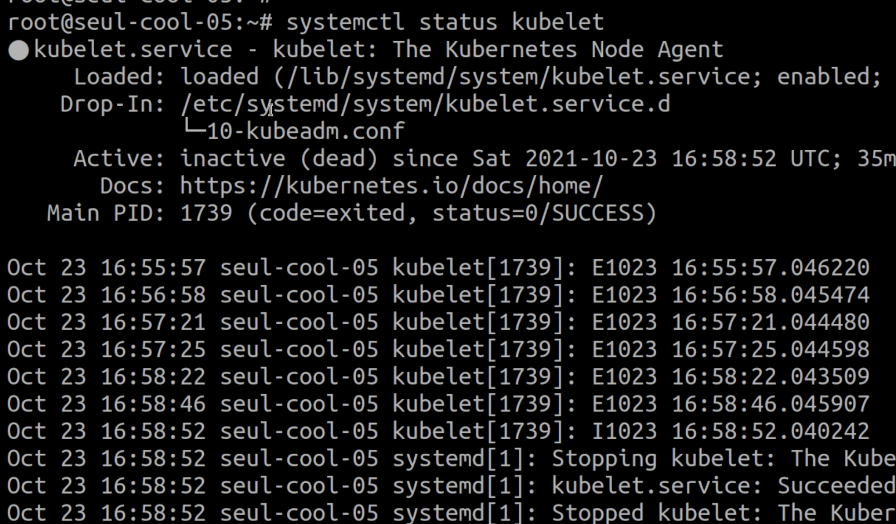
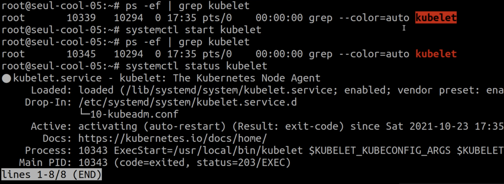
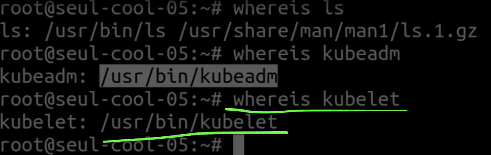
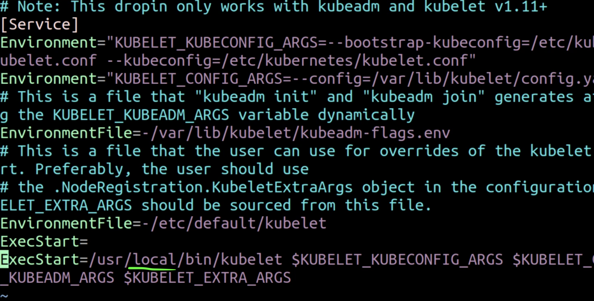
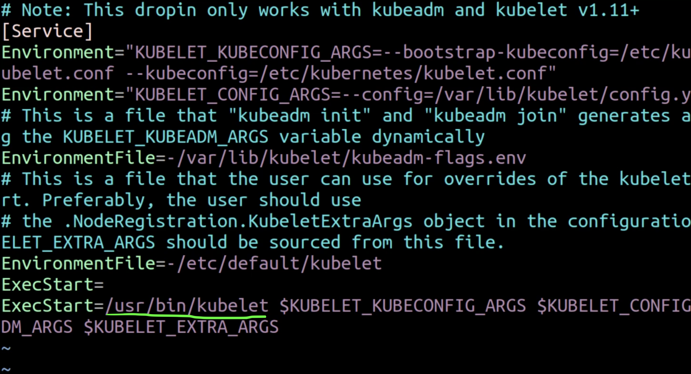
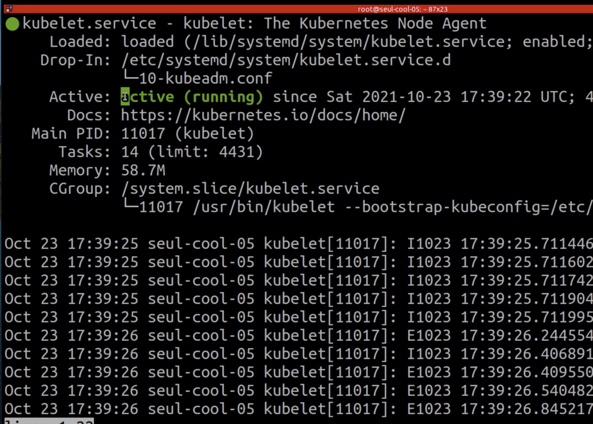
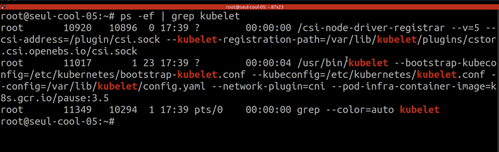

## DAY6

### Documentação do Dia

- 

- 


### Questao 1
O nosso gerente observou no Lens que um dos nossos nodes não está bem. Temos algum problema com o nosso cluster e precisamos resolver agora.

<details>
 
 <summary><b>  Pré-Tasks 1 </b> <em>(clique para ver as pré-tasks)</em></summary>

- Com o comando abaixo, verificamos alguns CrashLoopBacks.
```markdown
k get pods -A 
```
- Com o comando abaixo, verificamos um Node com status NotReady.
```markdown
k get nodes
``` 
- Entramos nos node Not Ready
```markdown
k describe nodes "nome_node"
```
- Podemos então entrar no Host via SSH e checar o kubelet 
```markdown
systemctl status kubelet
```


- Checamos então se o kubelet ao menos está rodando
```markdown
ps -ef | grep kubelet
```


- Checamos se existe o /usr/local/bin/kubelet
```markdown
ls -lha /usr/local/bin/kubelet
```

- Checamos agora o binário e manpage do kubelet
```markdown
whereis kubelet
```


Com isto percebemos que o Systemctl está apontando para o path ERRADO do binario do Kubelet.

Se executarmos /usr/local/bin/kubelet não teremos retorno algum
Por outro lado, se executarmos /usr/bin/kubelet, neste sim teremos resposta do serviço.

Desta forma, só nos resta ajustar a path do binario do kubelet no arquivo de configuracao do Systemd.

</details>

<details>

 <summary><b> Resposta 1 </b> <em>(clique para ver a resposta)</em></summary>


Entramos no arquivo de configuracao do Systemd relativo ao kubelet e identificamos o path errado.
```markdown
vim /etc/systemd/system/kubelet.service.d/10-kubeadm.conf
```



Alteramos para o path correto.




Reload no Systemd e Kubelet, para re-ler todos os arquivos de configuracao.
```markdown
systemctl daemon-reload
```
```markdown
systemctl restart kubelet
```
```markdown
systemctl status kubelet
```



```markdown
ps -ef | grep kubelet
```


Verificamos o status dos PODs e Nodes do Cluster novamente

```markdown
k get nodes
``` 
```markdown
k get pods -A 
```

</details>

### Questao 2

<details>
 <summary><b>  Pré-Tasks 2 </b> <em>(clique para ver as pré-tasks)</em></summary>


</details>
<details>
 <summary><b> Resposta 2 </b> <em>(clique para ver a resposta)</em></summary>

</details>